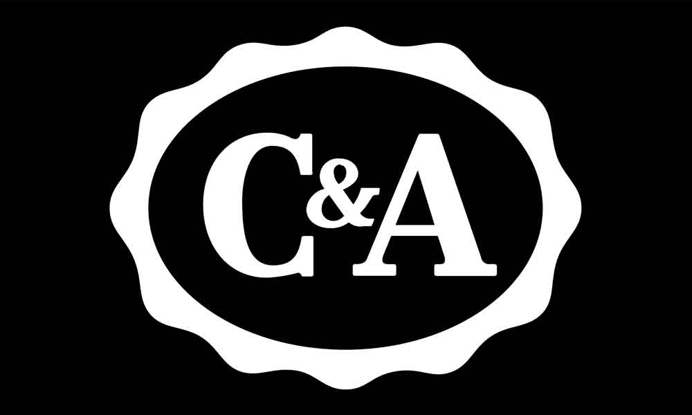
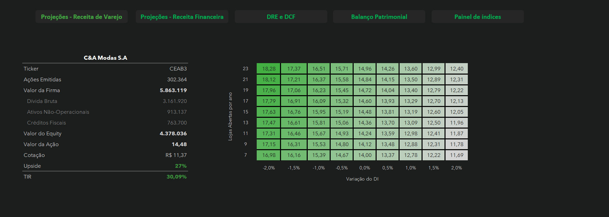

# 🧮 Valuation e Modelagem Financeira - C&A MODAS S.A (CEAB3) 

## 💼 Sobre o Projeto

Este projeto consiste em uma modelagem financeira e valuation completo pelo método do **Fluxo de caixa Descontado**, a fim de encontrar o valor justo da ação negociada na bolsa da empresa C&A(CEAB3) considerando as projeções de **2026** a **2029** e entrando na perpetuidade em **2030**, desconsiderando a princípio os resultados trimestrais.
 Após a coleta dos dados da empresa de 2016 até o ano de 2025, utilizando **Microsoft Excel** foram realizadas as projeções para a empresa, separadas em abas da planilha.
 

 
 

# 🎯 Metodologia do Modelo

 ## 🖥️ **Dashboard**
 - Apresenta o principal do Valuation, com o valor encontrado da ação de acordo com todas as projeções feitas ao longo do modelo, utilizando o método do Fluxo de caixa descontado.
 - Cálculo da TIR(Taxa interna de retorno), que é a avaliação do retorno implícito do fluxo de caixa projetado frente ao valor de mercado atual da companhia. Com a TIR sendo econtrada é mais fácil para o acionista tomar a decisão.
 - Matriz de sensibilidade, que visa explorar os diferentes cenários que a entidade pode enfrentar. Foi explorado o número de lojas abertas frente ao spread do DI, em que é possível observar com facilidade qual o valor da ação de acordo com algum cenário específico.
 
 
 ## ⚖️**Balanço Patrimonial**
 - Balanço Patrimonial da empresa com informações coletadas da DFP do ano de 2016 até o ano de 2025
 
 
## 💰**DRE + DFC**
- O coração do modelo, onde se encontra a DRE da empresa com informações coletadas da DFP do ano de 2016 até o ano de 2025 e junto a isso, as projeções de **Receita Líquida**, **EBIT**, **Depesas e receitas operacionais** e muitas outras.
- Cálculo do **NOPAT** pós IFRS16 que inclui também a depreciação e amortização de arrendamento
- Células agrupadas com cada item que a empresa faz o reinvestimento: **Capex**, **Variação do Capital de Giro** e suas respectivas projeções para 2026 até 2029.
- Cálculo final do **Fluxo de caixa livre pra firma**
- Cálculo do **WACC** considerando todas as métricas, levando o peso do do capital dos acionistas em conta juntamente com o cálculo do **Beta**, **Ke** e **Kd**.
- **Teste de Concistência** para validar as premissas conservadoras do modelo, com as projeções feitas o **ROIC** para a C&A apresentar os resultados projetados é consideravelmente abaixo do que a empresa vem apresentado nos anos passados
- Fluxos de caixa trazidos a valor presente de acordo com o modelo do fluxo de caixa descontado, para o cáculo do **valor da firma** apresentado na aba de dashboard do modelo.
- Aba com premissas mostrando o sentido de algumas projeções.
 

## 📊**Projeções - Receita de Varejo**
- Projeções de novas lojas abertas para a C&A se mantendo em 15 lojas abertas em cada ano.
- Separação de lojas por tempo aberto e cálculo da receita das lojas levando em conta a **Curva de Maturidade**, que faz o cálculo considerando a área de cada loja aberta de acordo com a sua "idade", utilizando essa curva para fazer o cálculo da **Receita por Loja Madura**.
- Ao final a projeção completa da Receita de Varejo e da Receita de Outros.
- Aba de premissas explicando o sentido de cada projeção.
 

## 📊**Projeções - Receita Financeira**
- Projeção da quantidade de cartões emitidos pela empresa se mantendo constante ao longo dos anos
- Projeção do Volume de Crédito por cartão se mantendo constante ao longo dos anos
- Projeção da despesa com **PDD**(Provisão para devedores duvidosos) para mensuração do risco de crédito
- Aba com premissas mostrando as projeções
 

##  **Painel de Índices**
- Projeção do Capital de Giro para calcular sua variação na parte de DRE+DCF
- Consolidação de indiciradores de rentabilidade
 

# 📈 Conceitos de Finanças Corporativas Aplicados

* **NOPAT:** Mensuração do lucro operacional puramente gerado pelos ativos, ajustado pela alíquota de EBIT recorrente.
* **WACC :** Ponderação entre o custo do capital próprio (**Ke**, calculado via modelo CAPM ajustado ao risco país e de mercado) e o custo da dívida pós-impostos.
* **ROIC (Retorno sobre o Capital Investido):** Análise histórica e projetada da eficiência da empresa em alocar capital nas suas operações.
* **TIR (Taxa Interna de Retorno):** Avaliação do retorno implícito do fluxo de caixa projetado frente ao valor de mercado atual da companhia.
* **Necessidade de Capital de Giro :** Projeção analítica de prazos médios de estoque, recebíveis e fornecedores para entender o consumo de caixa operacional.

## 👇Para conferir todos os cálculos e premissas

⬇️ [Clique aqui para baixar a planilha completa](Valuation/Valuation_DCF.xlsx)

